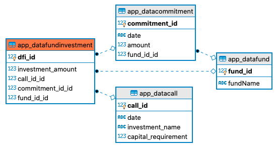

# capital-call

## What is a capital call? And what does this application do?

Private equity firms hold investors' money in various funds, if the money is not being actively invested.
When fund managers wish to make an investment, they must withdraw investors' capital from these funds.
In order to do this they must use a methodology to determine which investor(s) capital commitments will
be withdrawn.
Capital  commitments can be arranged in a table as below, where one commitment represents a single investor's
capital within a certain fund, invested at a certain date.

| Commitment ID | Fund   | Date       | Amount     |
|--------------:|-------:|-----------:|-----------:|
| 1             | Fund 1 | 01/05/2020 | 10,000,000 |
| 2             | Fund 3 | 04/08/2020 | 24,000,000 |
| 3             | Fund 2 | 17/10/2020 | 16,000,000 |

This application implements a First In, First Out (FIFO) methodology for selecting capital commitments to withdraw
from funds.

An example best illustrates what the application does.

Given the commitments above, a fund manager needs to withdraw 15,000,000 to fund an investment (we'll
call it 'Investment ABC'). Using the FIFO methodology this means they would need to first withdraw all capital from
Commitment ID = 1, which would leave them with 5,000,000 more to find. They would
also need to withdraw 5,000,000 from Commitment ID = 2. The withdrawal of capital from a commitment is known
as a capital call - a fund manager calls a certain amount of capital from a commitment.

This calculation is shown in the following table. "Drawdown" can be seen as equivalent to "withdrawal", as used above.

| Commitment ID |   Fund |       Date |     Amount | Undrawn Capital Commitment<br>before Drawdown |   Drawdown | Undrawn Capital Commitment<br>after Drawdown |
|--------------:|-------:|-----------:|-----------:|----------------------------------------------:|-----------:|---------------------------------------------:|
|             1 | Fund 1 | 01/08/2020 | 10,000,000 |                                    10,000,000 | 10,000,000 |                                            0 |
|             2 | Fund 3 | 04/05/2020 | 24,000,000 |                                    24,000,000 |  5,000,000 |                                   19,000,000 |
|             3 | Fund 2 | 17/10/2020 | 16,000,000 |                                    16,000,000 |          0 |                                   16,000,000 |

So, to go ahead with Investment ABC, the fund manager must call 10,000,000 from Commitment ID = 1 and 5,000,000
from Commitment ID = 2.

To get to this answer quickly, they could use this application! The app takes in a capital call (amount, date, targeted investment name), and calculates the amounts
needed to be called from each commitment.

## The insides of the app

The app was developed using the Django Web Framework, using Django Forms, Models, Views and the built-in SQLite database.

A quick look at the `app/` directory can give a good overview of how things fit together. Note, not all files within this 
directory are listed here.

`models.py` - the definition of the database models.<br>
`urls.py` - the definition of the URL endpoints used by the app's views.<br>
`forms.py` - define the form used to collect user input (for a call).<br>
`templates/` - contains the html templates rendered by the views.<br>
`views.py` - the methods (views) within are used to connect the user with the app's backend functionality.<br>
`callcontroller.py` - contains the CallController class which handles the call calculation and database
manipulations. Effectively the backend functionality of the app.<br>
`tests.py` - contains tests used to verify the call calculation made by the CallController class.<br>

## The models
Four models are used by the app:

* DataFund - contains the names and IDs of various funds.
* DataCommitment - contains the capital commitments of the investors (amounts, dates and which funds they are invested in).
* DataCall - contains the data relevant to capital calls (amount, date and what investment they were called for).
* DataFundInvestment - contains the records showing capital call transactions on different capital commitments.

`DataFund` and `DataCommitment` are initialised with data when the database migrations are made. They are not editable through the app, and serve only as inputs.
`DataCall` and `DataFundInvestment` are edited by the app. The results of user input and the call calculation are recorded in these tables.

The image below shows the relationships between the four database tables used by the app. A solid circle represents the table with the foreign key and an empty square represents the table with the primary key. 
This image was taken from DBeaver - Entity Relationship Diagram.<br>
<br>
The extra appended `"_id"` on many of the fields as in `commitment_id_id` in the `app_datafundinvestment` table are a consequence of DBeaver, the actual fields do not have the extra `"_id"` on the model fields. 

## Setting up the app for yourself

Clone the repo, then
```shell script
cd capital-call/capital_call
```
Set up a virtual environment
```shell script
python3 -m venv .venv
```
```shell script
source .venv/bin/activate
```
Install django
```shell script
pip3 install django
```
Make the database migrations and run the app, it should be available by default at `http://127.0.0.1:8000/`
```shell script
python3 manage.py migrate
```
```shell script
python3 manage.py runserver
```

